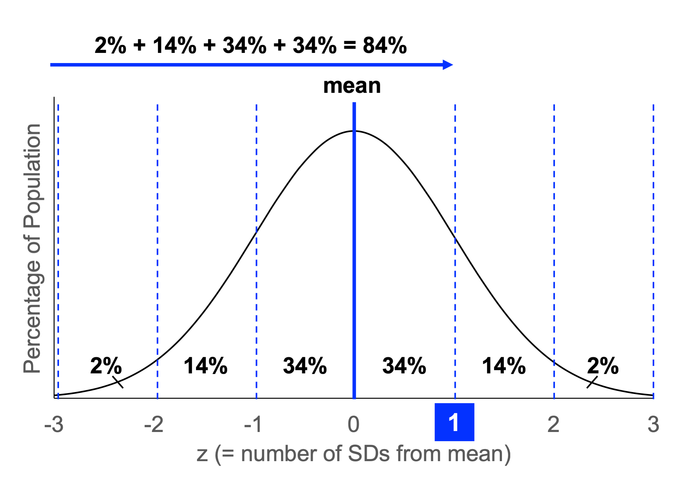

```{r setup, include=FALSE}
knitr::opts_chunk$set(echo = FALSE, message = FALSE, warning = FALSE)
knitr::opts_knit$set(root.dir = normalizePath('../'))

library(knitr) # Required for knitting
library(tidyverse) # Required for data cleaning
library(ggplot2) # Required for plots
```

```{r}
# Import data
data <- read.csv(file="data/data.csv", header = TRUE, stringsAsFactors = FALSE)

# Delete two unnecessary additional header rows from Qualtrics export
data <- data[-which(data$StartDate == "Start Date"), ] # Repeated header row with column names
data <- data[-1,] # Header row with Qualtrics code in curly brackets

# Convert columns to numeric
data.num <- grep("bfi", colnames(data))
data.num <- append(data.num, grep("rfq", colnames(data)))
data.num <- append(data.num, grep("rmq", colnames(data)))
data.num <- append(data.num, grep("mfq", colnames(data)))
data.num <- append(data.num, grep("rtq", colnames(data)))
data.num <- append(data.num, grep("ai", colnames(data)))
data.num <- append(data.num, grep("mb", colnames(data)))
data.num <- append(data.num, grep("catdog", colnames(data)))
data.num <- append(data.num, grep("teacoffee", colnames(data)))
data.num <- append(data.num, grep("penpencil", colnames(data)))
data.num <- append(data.num, grep("attnchk", colnames(data)))
data[data.num] <- lapply(data[data.num], as.numeric) # Convert columns from character to numeric
rm(data.num) # Clear data.num from workspace as it is no longer needed

# Removing "@columbia.edu" where it appears in UNI field
data$uni <- str_remove(data$uni, "@columbia.edu")

# Renaming and ordering factor levels where appropriate
data$gender[data$gender == "1"] <- "male"
data$gender[data$gender == "2"] <- "female"
data$gender[data$gender == "3"] <- "other"
data$gender <- as.factor(data$gender)

data$language[data$language == "1"] <- "english"
data$language[data$language == "2"] <- "spanish"
data$language[data$language == "3"] <- "other"
data$language <- as.factor(data$language)

data$ethnicity[!(data$ethnicity == "1" | data$ethnicity == "2" | data$ethnicity == "3" |
                  data$ethnicity == "4" | data$ethnicity == "5" | data$ethnicity == "6" |
                  data$ethnicity == "7" | is.na(data$ethnicity) == TRUE)] <- "multi"
data$ethnicity[data$ethnicity == "1"] <- "amerindian"
data$ethnicity[data$ethnicity == "2"] <- "asian"
data$ethnicity[data$ethnicity == "3"] <- "black"
data$ethnicity[data$ethnicity == "4"] <- "hispanic"
data$ethnicity[data$ethnicity == "5"] <- "pacislander"
data$ethnicity[data$ethnicity == "6"] <- "white"
data$ethnicity[data$ethnicity == "7"] <- "other"
data$ethnicity <- as.factor(data$ethnicity)

data$education[data$education == "0"] <- "none"
data$education[data$education == "1"] <- "elementary"
data$education[data$education == "2"] <- "somehs"
data$education[data$education == "3"] <- "highschool"
data$education[data$education == "4"] <- "somecollege"
data$education[data$education == "5"] <- "associates"
data$education[data$education == "6"] <- "bachelors"
data$education[data$education == "7"] <- "masters"
data$education[data$education == "8"] <- "doctorate"
data$education <- as.factor(data$education)
data$education <- factor(data$education, ordered = TRUE, levels = c("none", "elementary", "somehs", "highschool", "somecollege", "associates", "bachelors", "masters", "doctorate"))

# In study, location presented as home state
data$location[data$location == "Prefer not to answer"] <- NA
data$location[data$location == "2"] <- "NotInUS"
data$location[data$location == "3"] <- "AL"
data$location[data$location == "4"] <- "AK"
data$location[data$location == "5"] <- "AS"
data$location[data$location == "6"] <- "AZ"
data$location[data$location == "7"] <- "AR"
data$location[data$location == "8"] <- "CA"
data$location[data$location == "58"] <- "CO"
data$location[data$location == "9"] <- "CT"
data$location[data$location == "10"] <- "DE"
data$location[data$location == "59"] <- "DC"
data$location[data$location == "12"] <- "FL"
data$location[data$location == "13"] <- "GA"
data$location[data$location == "14"] <- "GU"
data$location[data$location == "15"] <- "HI"
data$location[data$location == "16"] <- "ID"
data$location[data$location == "65"] <- "IL"
data$location[data$location == "66"] <- "IN"
data$location[data$location == "67"] <- "IA"
data$location[data$location == "68"] <- "KS"
data$location[data$location == "69"] <- "KY"
data$location[data$location == "70"] <- "LA"
data$location[data$location == "71"] <- "ME"
data$location[data$location == "72"] <- "MD"
data$location[data$location == "73"] <- "MA"
data$location[data$location == "74"] <- "MI"
data$location[data$location == "75"] <- "MN"
data$location[data$location == "76"] <- "MS"
data$location[data$location == "105"] <- "MO"
data$location[data$location == "77"] <- "MT"
data$location[data$location == "78"] <- "NE"
data$location[data$location == "79"] <- "NV"
data$location[data$location == "80"] <- "NH"
data$location[data$location == "81"] <- "NJ"
data$location[data$location == "82"] <- "NM"
data$location[data$location == "83"] <- "NY"
data$location[data$location == "84"] <- "NC"
data$location[data$location == "85"] <- "ND"
data$location[data$location == "86"] <- "MP"
data$location[data$location == "87"] <- "OH"
data$location[data$location == "88"] <- "OK"
data$location[data$location == "89"] <- "OR"
data$location[data$location == "90"] <- "PA"
data$location[data$location == "91"] <- "PR"
data$location[data$location == "92"] <- "RI"
data$location[data$location == "93"] <- "SC"
data$location[data$location == "94"] <- "SD"
data$location[data$location == "95"] <- "TN"
data$location[data$location == "96"] <- "TX"
data$location[data$location == "97"] <- "VI"
data$location[data$location == "98"] <- "UT"
data$location[data$location == "99"] <- "VT"
data$location[data$location == "100"] <- "VA"
data$location[data$location == "101"] <- "WA"
data$location[data$location == "102"] <- "WV"
data$location[data$location == "103"] <- "WI"
data$location[data$location == "104"] <- "WY"
data$location <- as.factor(data$location)

# Rescaling second group of MFQ items from 1-6 to 0-5
data$mfqcont_1 <- data$mfqcont_1 - 1
data$mfqcont_2 <- data$mfqcont_2 - 1
data$mfqcont_3 <- data$mfqcont_3 - 1
data$mfqcont_4 <- data$mfqcont_4 - 1
data$mfqcont_5 <- data$mfqcont_5 - 1
data$mfqcont_6 <- data$mfqcont_6 - 1
data$mfqcont_7 <- data$mfqcont_7 - 1
data$mfqcont_8 <- data$mfqcont_8 - 1
data$mfqcont_9 <- data$mfqcont_9 - 1
data$mfqcont_10 <- data$mfqcont_10 - 1
data$mfqcont_11 <- data$mfqcont_11 - 1
data$mfqcont_12 <- data$mfqcont_12 - 1
data$mfqcont_13 <- data$mfqcont_13 - 1
data$mfqcont_14 <- data$mfqcont_14 - 1
data$mfqcont_15 <- data$mfqcont_15 - 1
data$mfqcont_16 <- data$mfqcont_16 - 1

# Renaming MFQ items for easier calculation
data <- rename(data, mfq_17 = mfqcont_1, mfq_18 = mfqcont_2, mfq_19 = mfqcont_3, mfq_20 = mfqcont_4,
              mfq_21 = mfqcont_5, mfq_22 = mfqcont_6, mfq_23 = mfqcont_7, mfq_24 = mfqcont_8,
              mfq_25 = mfqcont_9, mfq_26 = mfqcont_10, mfq_27 = mfqcont_11, mfq_28 = mfqcont_12,
              mfq_29 = mfqcont_13, mfq_30 = mfqcont_14, mfq_31 = mfqcont_15, mfq_32 = mfqcont_16)

# Recoding fun measures for easier calculation
data$mb_1 <- recode(data$mb_1, "1" = "beach", "2" = "mountain")
data$mb_2 <- recode(data$mb_2, "1" = "mountain", "2" = "beach")
data$mb_3 <- recode(data$mb_3, "1" = "beach", "2" = "mountain")
data$mb_4 <- recode(data$mb_4, "1" = "mountain", "2" = "beach")
data$mb_5 <- recode(data$mb_5, "1" = "beach", "2" = "mountain")
data$mb_6 <- recode(data$mb_6, "1" = "mountain", "2" = "beach")
data$mb_1 <- recode(data$mb_1, "beach" = 1, "mountain" = 0) # mountain = 0, beach = 1
data$mb_2 <- recode(data$mb_2, "beach" = 1, "mountain" = 0) # mountain = 0, beach = 1
data$mb_3 <- recode(data$mb_3, "beach" = 1, "mountain" = 0) # mountain = 0, beach = 1
data$mb_4 <- recode(data$mb_4, "beach" = 1, "mountain" = 0) # mountain = 0, beach = 1
data$mb_5 <- recode(data$mb_5, "beach" = 1, "mountain" = 0) # mountain = 0, beach = 1
data$mb_6 <- recode(data$mb_6, "beach" = 1, "mountain" = 0) # mountain = 0, beach = 1
data$catdog.d <- recode(data$catdog, `1` = 0, `2` = 1) # cat = 0, dog = 1
data$catdog <- recode(data$catdog, `1` = "Cat", `2` = "Dog") # cat = 0, dog = 1
data$teacoffee.d <- recode(data$teacoffee, `1` = 0, `2` = 1) # tea = 0, coffee = 1
data$teacoffee <- recode(data$teacoffee, `1` = "Tea", `2` = "Coffee") # tea = 0, coffee = 1

##### CALCULATE SCALE SCORES

### BIG FIVE

# Extraversion: 1, 6R, 11, 16, 21R, 26, 31R, 36 (8 items)
data$extraversion <- (data$bfi_1 + (6-data$bfi_6) + data$bfi_11 + data$bfi_16 +
                       (6-data$bfi_21) + data$bfi_26 + (6-data$bfi_31) + data$bfi_36) / 8

# Agreeableness: 2R, 7, 12R, 17, 22, 27R, 32, 37R, 42 (9 items)
data$agreeableness <- ((6-data$bfi_2) + data$bfi_7 + (6-data$bfi_12) + data$bfi_17 + data$bfi_22 +
                        (6-data$bfi_27) + data$bfi_32 + (6-data$bfi_37) + data$bfi_42) / 9


# Conscientiousness: 3, 8R, 13, 18R, 23R, 28, 33, 38, 43R (9 items)
data$conscientiousness <- (data$bfi_3 + (6-data$bfi_8) + data$bfi_13 + (6-data$bfi_18) +
                            (6-data$bfi_23) + data$bfi_28 + data$bfi_33 + data$bfi_38 +
                            (6-data$bfi_43)) / 9

# Neuroticism: 4, 9R, 14, 19, 24R, 29, 34R, 39 (8 items)
data$neuroticism <- (data$bfi_4 + (6-data$bfi_9) + data$bfi_14 + data$bfi_19 +
                      (6-data$bfi_24) + data$bfi_29 + (6-data$bfi_34) + data$bfi_39) / 8

# Openness: 5, 10, 15, 20, 25, 30, 35R, 40, 41R, 44 (10 items)
data$openness <- (data$bfi_5 + data$bfi_10 + data$bfi_15 + data$bfi_20 + data$bfi_25 +
                   data$bfi_30 + (6-data$bfi_35) + data$bfi_40 + (6-data$bfi_41) +
                   data$bfi_44) / 10

### REGULULATORY FOCUS QUESTIONNAIRE

# Promotion
data$prom <- ((6-data$rfq_1) + data$rfq_3 + data$rfq_7 + (6-data$rfq_9) + data$rfq_10 + (6-data$rfq_11)) / 6

# Prevention
data$prev <- ((6-data$rfq_2) + (6-data$rfq_4) + data$rfq_5 + (6-data$rfq_6) + (6-data$rfq_8)) / 5

### REGULATORY MODE QUESTIONNAIRE

# Assessment
data$ass <- ((7-data$rmq_2) + data$rmq_6 + data$rmq_7 + data$rmq_9 + (7-data$rmq_10) + data$rmq_11 +
            data$rmq_15 + data$rmq_19 + data$rmq_20 + data$rmq_22 + (7-data$rmq_27) + data$rmq_30) / 12

# Locomotion
data$loc <- (data$rmq_1 + data$rmq_3 + data$rmq_4 + data$rmq_5 + data$rmq_8 + data$rmq_16 + data$rmq_21 +
            data$rmq_25 + data$rmq_28 + data$rmq_29 + (7-data$rmq_13) + (7-data$rmq_24)) / 12

### MORAL FOUNDATIONS QUESTIONNAIRE

# Harm/Care: 1, 7, 12, 17, 23, 28
data$harmcare <- data$mfq_1 + data$mfq_7 + data$mfq_12 + data$mfq_17 + data$mfq_23 + data$mfq_28

# Fairness/Reciprocity: 2, 8, 13, 18, 24, 29
data$fairrec <-  data$mfq_2 + data$mfq_8 + data$mfq_13 + data$mfq_18 + data$mfq_24 + data$mfq_29

# Ingroup/Loyalty: 3, 9, 14, 19, 25, 30
data$ingrployal <-  data$mfq_3 + data$mfq_9 + data$mfq_14 + data$mfq_19 + data$mfq_25 + data$mfq_30

# Authority/Respect: 4, 10, 15, 20, 26, 31
data$authresp <-  data$mfq_4 + data$mfq_10 + data$mfq_15 + data$mfq_20 + data$mfq_26 + data$mfq_31

# Purity/Sanctity: 5, 11, 16, 21, 27, 32
data$puresanc <-  data$mfq_5 + data$mfq_11 + data$mfq_16 + data$mfq_21 + data$mfq_27 + data$mfq_32

### RELATIONSHIP THEORIES QUESTIONNAIRE

# Soulmate: 1, 2, 3, 4, 5, 6R, 7, 8R, 9, 10, 11
data$soulmate <- (data$rtq_1 + data$rtq_2 + data$rtq_3 + data$rtq_4 + data$rtq_5 + (8-data$rtq_6) +
                 data$rtq_7 + (8-data$rtq_8) + data$rtq_9 + data$rtq_10 + data$rtq_11) / 11

# Work-it-out: 12, 13, 14, 15, 16, 17, 18, 19, 20
data$workitout <- (data$rtq_12 + data$rtq_13 + data$rtq_14 + data$rtq_15 + data$rtq_16 + data$rtq_17 +
                  data$rtq_18 + data$rtq_19 + data$rtq_20) / 9

### ASPIRATION INDEX

# Self-acceptance: 8, 16, 23, 35
data$selfaccept.raw <- (data$ai_imp_8 + data$ai_imp_16 + data$ai_imp_23 + data$ai_imp_35) / 4

# Affiliation: 9, 14, 18, 30, 40
data$affil.raw <- (data$ai_imp_9 + data$ai_imp_14 + data$ai_imp_18 + data$ai_imp_30 + data$ai_imp_40) / 5

# Community feeling: 6, 19, 27, 32, 39
data$commflg.raw <- (data$ai_imp_6 + data$ai_imp_19 + data$ai_imp_27 + data$ai_imp_32 + data$ai_imp_39) / 5

# Physical fitness: 1, 7, 24, 31
data$physfit.raw <- (data$ai_imp_1 + data$ai_imp_7 + data$ai_imp_24 + data$ai_imp_31) / 4

# Financial success: 4, 12, 25, 37
data$finsucc.raw <- (data$ai_imp_4 + data$ai_imp_12 + data$ai_imp_25 + data$ai_imp_37) / 4

# Attractive appearance: 3, 10, 22, 28, 42
data$attractive.raw <- (data$ai_imp_3 + data$ai_imp_10 + data$ai_imp_22 + data$ai_imp_28 + data$ai_imp_42) / 5

# Social recognition: 2, 5, 15, 29, 38
data$socrec.raw <- (data$ai_imp_2 + data$ai_imp_5 + data$ai_imp_15 + data$ai_imp_29 + data$ai_imp_38) / 5

# Computing average across all AI subscales
data$ai.avg <- (data$selfaccept.raw + data$affil.raw + data$commflg.raw + data$physfit.raw + data$finsucc.raw + 
               data$attractive.raw + data$socrec.raw) / 7

# Relative importance

# Self-acceptance
data$selfaccept <- data$selfaccept.raw - data$ai.avg

# Affiliation
data$affil <- data$affil.raw - data$ai.avg

# Community feeling
data$commflg <- data$commflg.raw - data$ai.avg

# Physical fitness
data$physfit <- data$physfit.raw - data$ai.avg

# Financial success
data$finsucc <- data$finsucc.raw - data$ai.avg

# Attractive appearance
data$attractive <- data$attractive.raw - data$ai.avg

# Social recognition
data$socrec <- data$socrec.raw - data$ai.avg

# Intrinsic aspirations
data$intrinsic <- (data$selfaccept + data$affil + data$commflg + data$physfit) / 4

# Extrinsic aspirations
data$extrinsic <- (data$finsucc + data$attractive + data$socrec) / 3

### FUN MEASURES

# Proportion of beach (vs. mountain)
data$beach.prop <- (data$mb_1 + data$mb_2 + data$mb_3 + data$mb_4 + data$mb_5 + data$mb_6) / 6
data <- data %>%
  mutate(beach = case_when(is.na(beach.prop) ~ "No Preference",
    (beach.prop > .5) ~ "Beach",
    (beach.prop < .5) ~ "Mountain",
    (beach.prop == .5) ~ "No Preference"))

##### GENERATE CLASS SUMMARY STATISTICS

### BIG FIVE

# Extraversion
extraversion.mean <- mean(data$extraversion, na.rm = TRUE)
extraversion.sd <- sd(data$extraversion, na.rm = TRUE)

# Agreeableness
agreeableness.mean <- mean(data$agreeableness, na.rm = TRUE)
agreeableness.sd <- sd(data$agreeableness, na.rm = TRUE)

# Conscientiousness
conscientiousness.mean <- mean(data$conscientiousness, na.rm = TRUE)
conscientiousness.sd <- sd(data$conscientiousness, na.rm = TRUE)

# Neuroticism
neuroticism.mean <- mean(data$neuroticism, na.rm = TRUE)
neuroticism.sd <- sd(data$neuroticism, na.rm = TRUE)

# Openness
openness.mean <- mean(data$openness, na.rm = TRUE)
openness.sd <- sd(data$openness, na.rm = TRUE)

### REGULULATORY FOCUS QUESTIONNAIRE

# Promotion
prom.mean <- mean(data$prom, na.rm = TRUE)
prom.sd <- sd(data$prom, na.rm = TRUE)

# Prevention
prev.mean <- mean(data$prev, na.rm = TRUE)
prev.sd <- sd(data$prev, na.rm = TRUE)

### REGULATORY MODE QUESTIONNAIRE

# Locomotion
loc.mean <- mean(data$loc, na.rm = TRUE)
loc.sd <- sd(data$loc, na.rm = TRUE)

# Assessment
ass.mean <- mean(data$ass, na.rm = TRUE)
ass.sd <- sd(data$ass, na.rm = TRUE)

### MORAL FOUNDATIONS QUESTIONNAIRE

# Harm/Care
harmcare.mean <- mean(data$harmcare, na.rm = TRUE)
harmcare.sd <- sd(data$harmcare, na.rm = TRUE)

# Fairness/Reciprocity
fairrec.mean <- mean(data$fairrec, na.rm = TRUE)
fairrec.sd <- sd(data$fairrec, na.rm = TRUE)

# Ingroup/Loyalty
ingrployal.mean <- mean(data$ingrployal, na.rm = TRUE)
ingrployal.sd <- sd(data$ingrployal, na.rm = TRUE)

# Authority/Respect
authresp.mean <- mean(data$authresp, na.rm = TRUE)
authresp.sd <- sd(data$authresp, na.rm = TRUE)

# Purity/Sanctity
puresanc.mean <- mean(data$puresanc, na.rm = TRUE)
puresanc.sd <- sd(data$puresanc, na.rm = TRUE)

### RELATIONSHIP THEORIES QUESTIONNAIRE

# Soulmate
soulmate.mean <- mean(data$soulmate, na.rm = TRUE)
soulmate.sd <- sd(data$soulmate, na.rm = TRUE)

# Work-it-out
workitout.mean <- mean(data$workitout, na.rm = TRUE)
workitout.sd <- sd(data$workitout, na.rm = TRUE)

### ASPIRATION INDEX

# Self-acceptance (raw)
selfaccept.raw.mean <- mean(data$selfaccept.raw, na.rm = TRUE)
selfaccept.raw.sd <- sd(data$selfaccept.raw, na.rm = TRUE)

# Affiliation (raw)
affil.raw.mean <- mean(data$affil.raw, na.rm = TRUE)
affil.raw.sd <- sd(data$affil.raw, na.rm = TRUE)

# Community feeling (raw)
commflg.raw.mean <- mean(data$commflg.raw, na.rm = TRUE)
commflg.raw.sd <- sd(data$commflg.raw, na.rm = TRUE)

# Physical fitness (raw)
physfit.raw.mean <- mean(data$physfit.raw, na.rm = TRUE)
physfit.raw.sd <- sd(data$physfit.raw, na.rm = TRUE)

# Financial success (raw)
finsucc.raw.mean <- mean(data$finsucc.raw, na.rm = TRUE)
finsucc.raw.sd <- sd(data$finsucc.raw, na.rm = TRUE)

# Attractive appearance (raw)
attractive.raw.mean <- mean(data$attractive.raw, na.rm = TRUE)
attractive.raw.sd <- sd(data$attractive.raw, na.rm = TRUE)

# Social recognition (raw)
socrec.raw.mean <- mean(data$socrec.raw, na.rm = TRUE)
socrec.raw.sd <- sd(data$socrec.raw, na.rm = TRUE)

# Computing average across all AI subscales
ai.avg.mean <- (selfaccept.raw.mean + affil.raw.mean + commflg.raw.mean + physfit.raw.mean + finsucc.raw.mean + 
                attractive.raw.mean + socrec.raw.mean) / 7

## Relative importance

# Self-acceptance
selfaccept.mean <- selfaccept.raw.mean - ai.avg.mean

# Affiliation
affil.mean <- affil.raw.mean - ai.avg.mean

# Community feeling
commflg.mean <- commflg.raw.mean - ai.avg.mean

# Physical fitness
physfit.mean <- physfit.raw.mean - ai.avg.mean

# Financial success
finsucc.mean <- finsucc.raw.mean - ai.avg.mean

# Attractive appearance
attractive.mean <- attractive.raw.mean - ai.avg.mean

# Social recognition
socrec.mean <- socrec.raw.mean - ai.avg.mean

# Intrinsic aspirations
intrinsic.mean <- (selfaccept.mean + affil.mean + commflg.mean + physfit.mean) / 4

# Extrinsic aspirations
extrinsic.mean <- (finsucc.mean + attractive.mean + socrec.mean) / 3

### FUN MEASURES

# Proportion of beach (vs. mountain) responses
beach.prop.mean <- mean(data$beach.prop, na.rm = TRUE)
beach.prop.sd <- sd(data$beach.prop, na.rm = TRUE)

# Proportion of beach (vs. mountain) classmates
beach.prop <- (data %>% filter(beach == "Beach") %>% nrow()) / (data %>% nrow())
mountain.prop <- (data %>% filter(beach == "Mountain") %>% nrow()) / (data %>% nrow())
nopref.prop <- (data %>% filter(beach == "No Preference") %>% nrow()) / (data %>% nrow())

# Proportion of coffee (vs. tea) classmates
coffee.mean <- mean(data$teacoffee.d, na.rm = TRUE)

# Proportion of dog (vs. cat) classmates
dog.mean <- mean(data$catdog.d, na.rm = TRUE)

##### GENERATE CLASS PLOTS

### BIG FIVE

# Extraversion plot
extraversion.plot <- data %>% ggplot(aes(x = extraversion)) +
  coord_cartesian(xlim = c(1, 5)) +
  geom_histogram(binwidth = .5, boundary = 0, alpha = .5) +
  labs(x="Extraversion (1 = Low; 5 = High)", y = "Frequency in Class") +
  theme_classic()

# Agreeableness plot
agreeableness.plot <- data %>% ggplot(aes(x = agreeableness)) +
  coord_cartesian(xlim = c(1, 5)) +
  geom_histogram(binwidth = .5, boundary = 0, alpha = .5) +
  labs(x="Agreeableness (1 = Low; 5 = High)", y = "Frequency in Class") +
  theme_classic()

# Conscientiousness plot
conscientiousness.plot <- data %>% ggplot(aes(x = conscientiousness)) +
  coord_cartesian(xlim = c(1, 5)) +
  geom_histogram(binwidth = .5, boundary = 0, alpha = .5) +
  labs(x="Conscientiousness (1 = Low; 5 = High)", y = "Frequency in Class") +
  theme_classic()

# Neuroticism plot
neuroticism.plot <- data %>% ggplot(aes(x = neuroticism)) +
  coord_cartesian(xlim = c(1, 5)) +
  geom_histogram(binwidth = .5, boundary = 0, alpha = .5) +
  labs(x="Neuroticism (1 = Low; 5 = High)", y = "Frequency in Class") +
  theme_classic()

# Openness plot
openness.plot <- data %>% ggplot(aes(x = openness)) +
  coord_cartesian(xlim = c(1, 5)) +
  geom_histogram(binwidth = .5, boundary = 0, alpha = .5) +
  labs(x="Openness (1 = Low; 5 = High)", y = "Frequency in Class") +
  theme_classic()

### REGULULATORY FOCUS QUESTIONNAIRE

rfqnames <- c("Promotion Pride", "Prevention Pride")
rfqmeans <- c(prom.mean, prev.mean)
rfqsummary <- data.frame(cbind(rfqnames, rfqmeans))
rfqsummary$rfqmeans <- as.numeric(as.character(rfqsummary$rfqmeans))

rfq.plot <- ggplot(data = rfqsummary, aes(x = rfqnames, y = rfqmeans)) +
  geom_col(alpha = .5) +
  labs(x = NULL, y = "Regulatory Focus Pride\n(1 = Low; 5 = High)") +
  coord_cartesian(ylim = c(.5, 5)) +
  theme_classic()

### REGULATORY MODE QUESTIONNAIRE

rmqnames <- c("Assessment", "Locomotion")
rmqmeans <- c(ass.mean, loc.mean)
rmqsummary <- data.frame(cbind(rmqnames, rmqmeans))
rmqsummary$rmqmeans <- as.numeric(as.character(rmqsummary$rmqmeans))

rmq.plot <- ggplot(data = rmqsummary, aes(x = rmqnames, y = rmqmeans)) +
  geom_col(alpha = .5) +
  labs(x = NULL, y = "Regulatory Mode\n(1 = Low; 6 = High)") +
  coord_cartesian(ylim = c(.5, 6)) +
  theme_classic()

### MORAL FOUNDATIONS QUESTIONNAIRE

mfqnames <- c("Care/Harm", "Fairness/Cheating", "Loyalty/Betrayal", "Authority/Subversion", "Sanctity/Degradation")
mfqmeans <- c(harmcare.mean, fairrec.mean, ingrployal.mean, authresp.mean, puresanc.mean)
mfqsummary <- data.frame(cbind(mfqnames, mfqmeans))
mfqsummary$mfqnames <- factor(mfqsummary$mfqnames, ordered = TRUE, levels = c("Care/Harm", "Fairness/Cheating",
                                                                              "Loyalty/Betrayal", "Authority/Subversion",
                                                                              "Sanctity/Degradation"))
mfqsummary$mfqmeans <- as.numeric(as.character(mfqsummary$mfqmeans))

mfq.plot <- ggplot(data = mfqsummary, aes(x = mfqnames, y = mfqmeans)) +
  geom_col(alpha = .5) +
  labs(x = NULL, y = "Moral Foundation Strength\n(0 = Low; 30 = High)") +
  coord_cartesian(ylim = c(0, 30)) +
  theme_classic()

### RELATIONSHIP THEORIES QUESTIONNAIRE

rtqnames <- c("Soulmate", "Work-It-Out")
rtqmeans <- c(soulmate.mean, workitout.mean)
rtqsummary <- data.frame(cbind(rtqnames, rtqmeans))
rtqsummary$rtqmeans <- as.numeric(as.character(rtqsummary$rtqmeans))

rtq.plot <- ggplot(data = rtqsummary, aes(x = rtqnames, y = rtqmeans)) +
  geom_col(alpha = .5) +
  labs(x = NULL, y = "Relationship Theory Endorsement\n(1 = Low; 7 = High)") +
  coord_cartesian(ylim = c(.5, 7)) +
  theme_classic()

### ASPIRATION INDEX

# Relative Importance of All Aspirations

ainames <- c("Self-Acceptance", "Affiliation", "Community Feeling", "Physical Fitness", "Financial Success",
             "Attractive Appearance", "Social Recognition")
aimeans <- c(selfaccept.mean, affil.mean, commflg.mean, physfit.mean, finsucc.mean, attractive.mean, socrec.mean)
aitype <- c("Intrinsic", "Intrinsic", "Intrinsic", "Intrinsic", "Extrinsic", "Extrinsic", "Extrinsic")
aisummary <- data.frame(cbind(ainames, aimeans, aitype))
aisummary$ainames <- factor(aisummary$ainames, ordered = TRUE, levels = c("Self-Acceptance", "Affiliation", "Community Feeling", "Physical Fitness", "Financial Success",
                                                                          "Attractive Appearance", "Social Recognition"))
aisummary$aimeans <- as.numeric(as.character(aisummary$aimeans))

ai.plot <- ggplot(data = aisummary, aes(x = ainames, y = aimeans)) +
  geom_col(alpha = .5, aes(fill = aitype)) +
  scale_fill_manual(name = "Aspiration Type", values = c("Extrinsic" = "forestgreen", "Intrinsic" = "blue")) +
  geom_hline(aes(yintercept = 0)) +
  labs(x = NULL, y = "Relative Importance of Domain\n(0 = Average Across Domains)") +
  theme_classic() +
  theme(axis.text.x = element_text(angle = 45, vjust = 1, hjust = 1))

# Relative Importance of Intrinsic vs. Extrinsic Aspirations

inexnames <- c("Intrinsic", "Extrinsic")
inexmeans <- c(intrinsic.mean, extrinsic.mean)
inexsummary <- data.frame(cbind(inexnames, inexmeans))
inexsummary$inexnames <- factor(inexsummary$inexnames, ordered = TRUE, levels = c("Intrinsic", "Extrinsic"))
inexsummary$inexmeans <- as.numeric(as.character(inexsummary$inexmeans))

inex.plot <- ggplot(data = inexsummary, aes(x = inexnames, y = inexmeans)) +
  geom_col(alpha = .5, aes(fill = inexnames)) +
  scale_fill_manual(name = "Aspiration Type", values = c("Extrinsic" = "forestgreen", "Intrinsic" = "blue")) +
  geom_hline(aes(yintercept = 0)) +
  labs(x = NULL, y = "Relative Importance of Domain\n(0 = Average Across Domains)") +
  theme_classic()

### FUN MEASURES

# Proportion of beach (vs. mountain)
beach.plot <- data %>% subset(!is.na(beach)) %>% ggplot(aes(x = "", fill = factor(beach))) +
  geom_bar(width = 1) +
  coord_polar("y", start = 0) +
  scale_fill_manual(name = "Preferred\nDestination", values = c("Beach" = "turquoise", "Mountain" = "forestgreen", "No Preference" = "gray")) +
  theme_void()

# Proportion of coffee (vs. tea)
coffee.plot <- data %>% subset(!is.na(teacoffee)) %>% ggplot(aes(x = "", fill = factor(teacoffee))) +
  geom_bar(width = 1) +
  coord_polar("y", start = 0) +
  scale_fill_manual(name = "Preferred\nBeverage", values = c("Coffee" = "#331a00", "Tea" = "darkorange3")) +
  theme_void()

# Proportion of dog (vs. cat)
dog.plot <- data %>% subset(!is.na(catdog)) %>% ggplot(aes(x = "", fill = factor(catdog))) +
  geom_bar(width = 1) +
  coord_polar("y", start = 0) +
  scale_fill_manual(name = "Preferred\nPet", values = c("Cat" = "gray50", "Dog" = "chocolate4")) +
  theme_void()
```

## Agenda

* Discuss how to interpret means, standard deviations, and z-scores
* Learn to transform z-scores into percentile scores
* Review personality questionnaire results
* Complete and submit in-class response to this exercise
    - Due at end of class period

## Summary Statistics | Mean and Standard Deviation {.build}

<span style=font-weight:bold>Mean:</span>

* Measure of central tendency
* Average of all observations for a given variable

<span style=font-weight:bold>Standard Deviation:</span>

* Measure of variability or "spread" of data
* Square root of the sum of the squared deviations from the mean
* (Don't worry too much about these specifics; you won't need to calculate SDs in this exercise)

## Inferential Statistics | Normal Distribution

<div style="float: left; width: 62%;">
```{r ndist1, fig.width = 5.5, fig.height = 3.5, echo = FALSE}
ggplot(data = data.frame(x = c(-3, 3)), aes(x)) +
  stat_function(fun = dnorm, n = 101, args = list(mean = 0, sd = 1)) +
  xlab("z") +
  ylab("Percentage of Population") +
  scale_x_continuous(breaks = c(-3, -2, -1, 0, 1, 2, 3)) +
  scale_y_continuous(breaks = 0) +
  theme_classic() +
  theme(text = element_text(size = 15))
```
</div>

<div style="float: right; width: 38%;">
The normal distribution is a very common probability distribution

* Also known as a Gaussian distribution or "bell curve"
* Many variables are normally distributed (e.g., height, weight, IQ)
* We can use it to make inferences about unknown variables
</div>

## Inferential Statistics | Normal Distribution

<div style="float: left; width: 62%;">
```{r ndist2, fig.width = 5.5, fig.height = 3.5, echo = FALSE}
ggplot(data = data.frame(x = c(-3, 3)), aes(x)) +
  stat_function(fun = dnorm, n = 101, args = list(mean = 0, sd = 1)) +
  xlab("z") +
  ylab("Percentage of Population") +
  scale_x_continuous(breaks = c(-3, -2, -1, 0, 1, 2, 3)) +
  scale_y_continuous(breaks = 0) +
  theme_classic() +
  theme(text = element_text(size = 15))
```
</div>

<div style="float: right; width: 38%;">
Any normal distribution can be described by two parameters:
</div>

## Inferential Statistics | Normal Distribution

<div style="float: left; width: 62%;">
```{r ndist3, fig.width = 5.5, fig.height = 3.5, echo = FALSE}
ggplot(data = data.frame(x = c(-3, 3)), aes(x)) +
  stat_function(fun = dnorm, n = 101, args = list(mean = 0, sd = 1)) +
  geom_vline(aes(xintercept = 0), color = 'blue', size = 2) +
  xlab("z") +
  ylab("Percentage of Population") +
  scale_x_continuous(breaks = c(-3, -2, -1, 0, 1, 2, 3)) +
  scale_y_continuous(breaks = 0) +
  theme_classic() +
  theme(text = element_text(size = 15))
```
</div>

<div style="float: right; width: 38%;">
Any normal distribution can be described by two parameters:

* The **mean** indicates where the peak of the distribution is located
</div>

## Inferential Statistics | Normal Distribution

<div style="float: left; width: 62%;">
```{r ndist4, fig.width = 5.5, fig.height = 3.5, echo = FALSE}
ggplot(data = data.frame(x = c(-3, 3)), aes(x)) +
  stat_function(fun = dnorm, n = 101, args = list(mean = 0, sd = 1)) +
  geom_vline(aes(xintercept = 0), color = 'blue', size = 2) +
  geom_vline(aes(xintercept = 1), color = 'blue', linetype = 'dashed') +
  geom_vline(aes(xintercept = -1), color = 'blue', linetype = 'dashed') +
  xlab("z") +
  ylab("Percentage of Population") +
  scale_x_continuous(breaks = c(-3, -2, -1, 0, 1, 2, 3)) +
  scale_y_continuous(breaks = 0) +
  theme_classic() +
  theme(text = element_text(size = 15))
```
</div>

<div style="float: right; width: 38%;">
Any normal distribution can be described by two parameters:

* The **mean** indicates where the peak of the distribution is located
* The **standard deviation** indicates the typical distance between any given point and the mean
</div>

## Inferential Statistics | z-Scores

A *z*-score indicates the number of standard deviations between a particular observation and the mean.

$$z = \frac{value - mean}{SD}$$

## Transforming z-Scores into Percentiles

```{r ztop, out.width = "600px", fig.align = "center"}

```

## Transforming z-Scores into Percentiles

```{r ztop-2, out.width = "600px", fig.align = "center"}
knitr::include_graphics("img/normdist_z-2.png")
```

## Transforming z-Scores into Percentiles

```{r ztop-1, out.width = "600px", fig.align = "center"}

```

## Transforming z-Scores into Percentiles

```{r ztop0, out.width = "600px", fig.align = "center"}

```

## Transforming z-Scores into Percentiles

```{r ztop1, out.width = "600px", fig.align = "center"}

```

## Transforming z-Scores into Percentiles

```{r ztop2, out.width = "600px", fig.align = "center"}

```

## Transforming z-Scores into Percentiles

```{r ztop3, out.width = "600px", fig.align = "center"}

```

## Transforming z-Scores into Percentiles

```{r ztable, out.width = "600px", fig.align = "center"}

```

https://www.pindling.org/Math/Learning/Statistics/z_scores_table.htm

## Big Five Inventory | John, Donahue, & Kentle, 1991 {.build}

> * <span style=font-weight:bold>Extraversion:</span> assertive, full of energy, talkative
> * <span style=font-weight:bold>Agreeableness:</span> sympathetic, affectionate, kind
> * <span style=font-weight:bold>Conscientiousness:</span> planful, thorough, organized
> * <span style=font-weight:bold>Neuroticism:</span> anxious, tense
> * <span style=font-weight:bold>Openness to experience:</span> curious, imaginative, interested in a range of topics

## Big Five Inventory: Extraversion

<div style="float: left; width: 80%;">
```{r extraversion}
extraversion.plot +
  geom_vline(aes(xintercept = extraversion.mean), color = 'blue', size = 2) +
  theme(text = element_text(size = 20), axis.title.y = element_text(margin = margin(t = 0, r = 10, b = 0, l = 0)), axis.title.x = element_text(margin = margin(t = 10, r = 0, b = 0, l = 0)))
```
</div>

<div style="float: left; width: 20%;">
* <span style=font-weight:bold>Mean:</span> `r round(extraversion.mean, digits = 2)`
* <span style=font-weight:bold>SD:</span> `r round(extraversion.sd, digits = 2)`
</div>

## Big Five Inventory: Agreeableness

<div style="float: left; width: 80%;">
```{r agreeableness}
agreeableness.plot +
  geom_vline(aes(xintercept = agreeableness.mean), color = 'blue', size = 2) +
  theme(text = element_text(size = 20), axis.title.y = element_text(margin = margin(t = 0, r = 10, b = 0, l = 0)), axis.title.x = element_text(margin = margin(t = 10, r = 0, b = 0, l = 0)))
```
</div>

<div style="float: left; width: 20%;">
* <span style=font-weight:bold>Mean:</span> `r round(agreeableness.mean, digits = 2)`
* <span style=font-weight:bold>SD:</span> `r round(agreeableness.sd, digits = 2)`
</div>

## Big Five Inventory: Conscientiousness

<div style="float: left; width: 80%;">
```{r conscientiousness}
conscientiousness.plot +
  geom_vline(aes(xintercept = conscientiousness.mean), color = 'blue', size = 2) +
  theme(text = element_text(size = 20), axis.title.y = element_text(margin = margin(t = 0, r = 10, b = 0, l = 0)), axis.title.x = element_text(margin = margin(t = 10, r = 0, b = 0, l = 0)))
```
</div>

<div style="float: left; width: 20%;">
* <span style=font-weight:bold>Mean:</span> `r round(conscientiousness.mean, digits = 2)`
* <span style=font-weight:bold>SD:</span> `r round(conscientiousness.sd, digits = 2)`
</div>

## Big Five Inventory: Neuroticism

<div style="float: left; width: 80%;">
```{r neuroticism}
neuroticism.plot +
  geom_vline(aes(xintercept = neuroticism.mean), color = 'blue', size = 2) +
  theme(text = element_text(size = 20), axis.title.y = element_text(margin = margin(t = 0, r = 10, b = 0, l = 0)), axis.title.x = element_text(margin = margin(t = 10, r = 0, b = 0, l = 0)))
```
</div>

<div style="float: left; width: 20%;">
* <span style=font-weight:bold>Mean:</span> `r round(neuroticism.mean, digits = 2)`
* <span style=font-weight:bold>SD:</span> `r round(neuroticism.sd, digits = 2)`
</div>

## Big Five Inventory: Opennness to Experience

<div style="float: left; width: 80%;">
```{r openness}
openness.plot +
  geom_vline(aes(xintercept = openness.mean), color = 'blue', size = 2) +
  theme(text = element_text(size = 20), axis.title.y = element_text(margin = margin(t = 0, r = 10, b = 0, l = 0)), axis.title.x = element_text(margin = margin(t = 10, r = 0, b = 0, l = 0)))
```
</div>

<div style="float: left; width: 20%;">
* <span style=font-weight:bold>Mean:</span> `r round(openness.mean, digits = 2)`
* <span style=font-weight:bold>SD:</span> `r round(openness.sd, digits = 2)`
</div>

## Regulatory Focus Questionnaire | Higgins et al., 2001

> * <span style=font-weight:bold>Prevention pride:</span> historical success in maintaining security and fulfilling responsibilities; approach new goals vigilantly
> * <span style=font-weight:bold>Promotion pride:</span> historical success in achieving hopes and aspirations; approach new goals eagerly

## Regulatory Focus Questionnaire | Higgins et al., 2001

<div style="float: left; width: 80%;">
```{r rfq}
rfq.plot +
  theme(text = element_text(size = 20), axis.title.y = element_text(margin = margin(t = 0, r = 10, b = 0, l = 0)), axis.title.x = element_text(margin = margin(t = 10, r = 0, b = 0, l = 0)))
```
</div>

<div style="float: left; width: 20%;">
* <span style=font-weight:bold>Prevention Mean:</span> `r round(prev.mean, digits = 2)` (SD = `r round(prev.sd, digits = 2)`)
* <span style=font-weight:bold>Promotion Mean:</span> `r round(prom.mean, digits = 2)` (SD = `r round(prom.sd, digits = 2)`)
</div>

## Regulatory Mode Questionnaire | Kruglanski et al., 2000

> * <span style=font-weight:bold>Assessment:</span> oriented toward thinking and critical evaluation in goal pursuit
> * <span style=font-weight:bold>Locomotion:</span> oriented toward doing, movement, and action in goal pursuit

## Regulatory Mode Questionnaire | Kruglanski et al., 2000

<div style="float: left; width: 80%;">
```{r rmq}
rmq.plot +
  theme(text = element_text(size = 20), axis.title.y = element_text(margin = margin(t = 0, r = 10, b = 0, l = 0)), axis.title.x = element_text(margin = margin(t = 10, r = 0, b = 0, l = 0)))
```
</div>

<div style="float: left; width: 20%;">
* <span style=font-weight:bold>Assessment Mean:</span> `r round(ass.mean, digits = 2)` (SD = `r round(ass.sd, digits = 2)`)
* <span style=font-weight:bold>Locomotion Mean:</span> `r round(loc.mean, digits = 2)` (SD = `r round(loc.sd, digits = 2)`)
</div>

## Moral Foundations Questionnaire | Graham, Haidt, & Nosek, 2008

> * <span style=font-weight:bold>Care/Harm:</span> kindness, compassion, nurturance
> * <span style=font-weight:bold>Fairness/Cheating:</span> justice, equality
> * <span style=font-weight:bold>Loyalty/Betrayal:</span> patriotism, ingroup loyalty
> * <span style=font-weight:bold>Authority/Subversion:</span> authority, respect for traditions
> * <span style=font-weight:bold>Sanctity/Degradation:</span> purity, chastity, avoidance of disgusting behavior

## Moral Foundations Questionnaire | Graham, Haidt, & Nosek, 2008

<div style="float: left; width: 65%;">
```{r mfq, fig.width = 6}
mfq.plot +
  theme(text = element_text(size = 18), axis.title.y = element_text(margin = margin(t = 0, r = 10, b = 0, l = 0)), axis.title.x = element_text(margin = margin(t = 10, r = 0, b = 0, l = 0))) +
  theme(axis.text.x = element_text(angle = 45, vjust = 1, hjust = 1))
```
</div>

<div style="float: left; width: 35%;">
* <span style=font-weight:bold>Care/Harm Mean:</span> `r round(harmcare.mean, digits = 2)` (SD = `r round(harmcare.sd, digits = 2)`)
* <span style=font-weight:bold>Fairness/Cheating Mean:</span> `r round(fairrec.mean, digits = 2)` (SD = `r round(fairrec.sd, digits = 2)`)
* <span style=font-weight:bold>Loyalty/Betrayal Mean:</span> `r round(ingrployal.mean, digits = 2)` (SD = `r round(ingrployal.sd, digits = 2)`)
* <span style=font-weight:bold>Authority/Subversion Mean:</span> `r round(authresp.mean, digits = 2)` (SD = `r round(authresp.sd, digits = 2)`)
* <span style=font-weight:bold>Sanctity/Degradation Mean:</span> `r round(puresanc.mean, digits = 2)` (SD = `r round(puresanc.sd, digits = 2)`)
</div>

## Relationship Theories Questionnaire | Franiuk, Cohen, & Pomerantz, 2002

> * <span style=font-weight:bold>Soulmate theories:</span> relationship satisfaction depends upon finding the right person
> * <span style=font-weight:bold>Work-it-out theories:</span> relationship satisfaction depends upon putting effort into the relationship

## Relationship Theories Questionnaire | Franiuk, Cohen, & Pomerantz, 2002

<div style="float: left; width: 80%;">
```{r rtq}
rtq.plot +
  theme(text = element_text(size = 20), axis.title.y = element_text(margin = margin(t = 0, r = 10, b = 0, l = 0)), axis.title.x = element_text(margin = margin(t = 10, r = 0, b = 0, l = 0)))
```
</div>

<div style="float: left; width: 20%;">
* <span style=font-weight:bold>Soulmate Mean:</span> `r round(soulmate.mean, digits = 2)` (SD = `r round(soulmate.sd, digits = 2)`)
* <span style=font-weight:bold>Work-It-Out Mean:</span> `r round(workitout.mean, digits = 2)` (SD = `r round(workitout.sd, digits = 2)`)
</div>

## Aspiration Index | Kasser & Ryan, 1996 {.build}

* <span style=font-weight:bold>Intrinsic:</span> fulfill fundamental needs
    - Self-acceptance
    - Affiliation
    - Feeling that one is part of a community
    - Physical fitness
* <span style=font-weight:bold>Extrinsic:</span> means to some other end
    - Financial success
    - Attractive appearance
    - Social recognition

## Aspiration Index | Kasser & Ryan, 1996

<div style="float: left; width: 65%;">
```{r ai, fig.width = 6}
ai.plot +
  theme(text = element_text(size = 16), axis.title.y = element_text(margin = margin(t = 0, r = 10, b = 0, l = 0)), axis.title.x = element_text(margin = margin(t = 10, r = 0, b = 0, l = 0)))
```
</div>

<div style="float: left; width: 35%;">
* <span style=font-weight:bold>Self-Acceptance:</span> `r round(selfaccept.mean, digits = 2)`
* <span style=font-weight:bold>Affiliation:</span> `r round(affil.mean, digits = 2)`
* <span style=font-weight:bold>Community Feeling:</span> `r round(commflg.mean, digits = 2)`
* <span style=font-weight:bold>Physical Fitness:</span> `r round(physfit.mean, digits = 2)`
* <span style=font-weight:bold>Financial Success:</span> `r round(finsucc.mean, digits = 2)`
* <span style=font-weight:bold>Attractive Appearance:</span> `r round(attractive.mean, digits = 2)`
* <span style=font-weight:bold>Social Recognition:</span> `r round(socrec.mean, digits = 2)`
</div>

## Preference Measures

<div style="float: left; width: 33%;">
### Beach or Mountain?

```{r beach, fig.width = 3, fig.height = 2.25}
beach.plot +
  theme(text = element_text(size = 18))
```

* <span style=font-weight:bold>Beach:</span> `r round(nrow(subset(data, beach == "Beach")) / nrow(data) * 100, digits = 0)`%
* <span style=font-weight:bold>Mountain:</span> `r round(nrow(subset(data, beach == "Mountain")) / nrow(data) * 100, digits = 0)`%

</div>

<div style="float: left; width: 33%;">
### Cat or Dog?

```{r dog, fig.width = 3, fig.height = 2.25}
dog.plot +
  theme(text = element_text(size = 18))
```

* <span style=font-weight:bold>Cat:</span> `r round(nrow(subset(data, catdog == "Cat")) / nrow(data) * 100, digits = 0)`%
* <span style=font-weight:bold>Dog:</span> `r round(nrow(subset(data, catdog == "Dog")) / nrow(data) * 100, digits = 0)`%

</div>

<div style="float: left; width: 33%;">
### Coffee or Tea?

```{r coffee, fig.width = 3, fig.height = 2.25}
coffee.plot +
  theme(text = element_text(size = 18))
```

* <span style=font-weight:bold>Coffee:</span> `r round(nrow(subset(data, teacoffee == "Coffee")) / nrow(data) * 100, digits = 0)`%
* <span style=font-weight:bold>Tea:</span> `r round(nrow(subset(data, teacoffee == "Tea")) / nrow(data) * 100, digits = 0)`%

</div>

## In-Class Reflection

* Download Word document from Assignments tab on Canvas
* Complete responses within the document:
    1. What did you learn about yourself that you didn't already know? (20 pts)
    2. What did you think was accurate? What was inaccurate? (20 pts)
    3. How could these measurements be improved? Why? (Justify your answer.) (10 pts)
* <span style=font-weight:bold>Formatting requirements:</span>
    - Maximum of 3 pages, double-spaced, Times New Roman 12 pt., 1" margins
    - Filename: FirstnameLastname_UNI.docx (e.g., EmilyNakkawita_ebn2111.docx)
* Submit on Canvas by the end of the class period